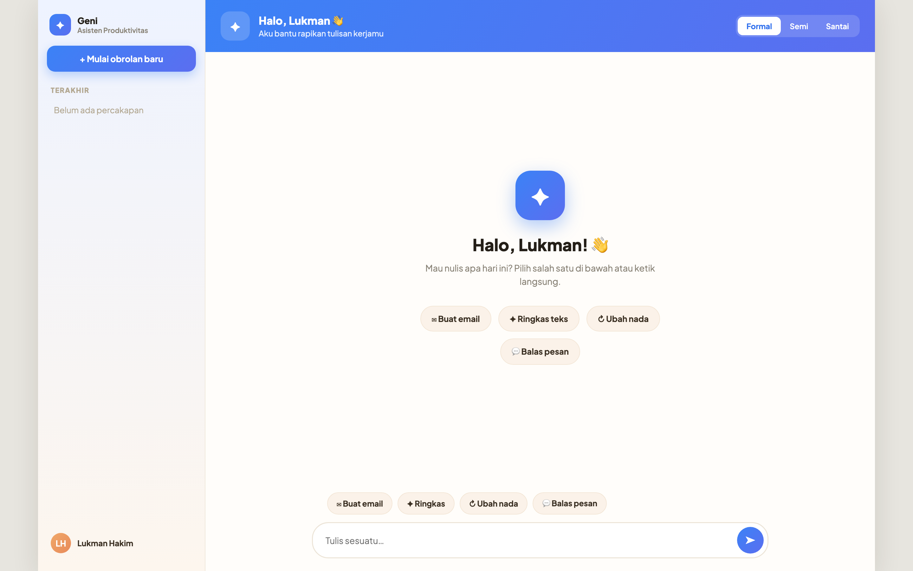
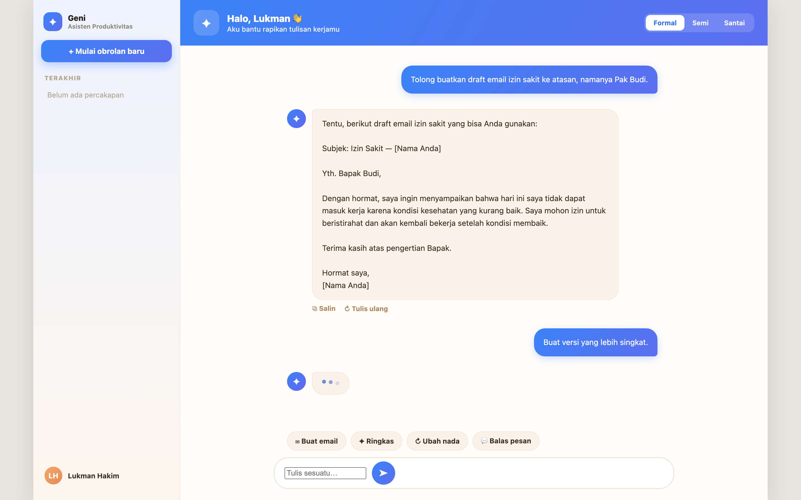

# Geni — Personal AI Assistant

**Geni** adalah chatbot web berbasis **Gemini 2.5 Flash** yang berperan sebagai
**Asisten Produktivitas**: asisten penulisan & komunikasi kerja berbahasa Indonesia. Geni
membantu menyusun dan memperbaiki email/pesan, meringkas teks, serta menyesuaikan nada
tulisan (formal ↔ santai).

Logika AI berjalan di **backend** (Express), sehingga `GEMINI_API_KEY` tidak pernah
terekspos ke browser. Frontend hanya menangani UI dan memanggil endpoint `/api/chat`.

> Final project Sesi 3 — course Hacktiv8 "AI Productivity and AI API Integration for Developers".

---

## 🖼️ Tampilan UI

| Welcome state | Percakapan (multi-turn) |
|---|---|
|  |  |

---

## ✨ Fitur

- **Chat multi-turn** — bot mengingat konteks percakapan dalam satu sesi (seluruh riwayat
  dikirim tiap request).
- **System Instruction** — persona, gaya jawaban, dan batasan ditetapkan di backend
  (asisten penulisan kerja, Bahasa Indonesia).
- **Parameter terkonfigurasi** — `temperature: 0.7` (seimbang untuk drafting).
- **Tone toggle** — Formal / Semi / Santai. Ditangani di frontend dengan menyisipkan
  prefix `"[Gunakan nada <tone>] "` ke pesan yang dikirim ke backend.
- **UI "Hangat & Personal"** — sidebar, header gradien biru, welcome state dengan quick-action
  chips, bubble bot krem hangat + avatar `✦`, tombol **Salin** & **Tulis ulang**, indikator
  typing tiga titik, dan **Mulai obrolan baru**.

---

## 🧰 Tech Stack

- **Node.js** v18+ (ES Modules — `"type": "module"`)
- **Express 5** — REST API + static file server
- **cors** — izinkan request lintas origin
- **dotenv** — memuat `GEMINI_API_KEY` dari `.env`
- **@google/genai** — SDK Gemini (model `gemini-2.5-flash`)
- Frontend: HTML/CSS/JS murni + font **Plus Jakarta Sans** (Google Fonts CDN)

---

## 🚀 Instalasi & Menjalankan

### 1. Install dependencies

```bash
npm install
```

### 2. Setup environment

Buat file `.env` di root project (lihat `.env.example` sebagai template):

```
GEMINI_API_KEY=your_api_key_here
```

Dapatkan API key dari [Google AI Studio](https://aistudio.google.com/app/apikey).

> `.env` tidak ikut di-commit (lihat `.gitignore`).

### 3. Jalankan server

```bash
npm start
```

Tunggu hingga muncul:

```
Server ready on http://localhost:3000
```

Lalu buka **http://localhost:3000** di browser.

---

## 📡 Dokumentasi Endpoint

### `POST /api/chat`

Percakapan multi-turn. Frontend mengirim **seluruh riwayat** percakapan tiap request.

**Request body** (JSON):

```json
{
  "conversation": [
    { "role": "user",  "text": "Tolong buatkan draft email izin cuti." },
    { "role": "model", "text": "Tentu, untuk siapa email ini ditujukan?" },
    { "role": "user",  "text": "Ke atasan saya, Pak Budi, 3 hari minggu depan." }
  ]
}
```

- `role`: `"user"` atau `"model"`.
- `text`: isi pesan.

**Response sukses** (`200`):

```json
{ "result": "<jawaban AI>" }
```

**Response error**:

| Status | Kondisi | Body |
|--------|---------|------|
| `400` | `conversation` bukan array | `{ "message": "Field 'conversation' harus berupa array." }` |
| `500` | Gagal memanggil Gemini | `{ "message": "<pesan error>" }` |

---

## 🧪 Cara Testing

### A. Lewat browser (UI) — utama

1. `npm start` → tunggu `Server ready on http://localhost:3000`.
2. Buka `http://localhost:3000/`.
3. Pastikan tampil sidebar + header gradien biru + welcome state dengan chips.
   Klik salah satu chip → input terisi; kirim → muncul typing → jawaban AI.
4. Coba **tone toggle** (Formal/Semi/Santai) lalu kirim pesan — gaya jawaban berubah.
5. Coba **multi-turn**:
   - "Tolong buatkan draft email izin sakit ke atasan."
   - Lanjut: "Buat versi yang lebih singkat." → bot paham konteks sebelumnya.
6. Coba tombol **Salin** & **Tulis ulang**, dan **Mulai obrolan baru**.

### B. Lewat curl / Postman (endpoint langsung)

```bash
curl -X POST http://localhost:3000/api/chat \
  -H "Content-Type: application/json" \
  -d '{"conversation":[{"role":"user","text":"Halo, kamu bisa bantu apa?"}]}'
```

Harus membalas `{ "result": "..." }`.

> Jika dapat `503 / UNAVAILABLE`, itu dari sisi Gemini (model sibuk) — coba lagi beberapa
> saat. Bukan bug.

---

## 📁 Struktur Project

```
gemini-chatbot-api/
├── index.js          # Backend Express: /api/chat + serve frontend
├── package.json      # ES Modules + dependencies + start script
├── .env              # GEMINI_API_KEY (tidak di-commit)
├── .env.example      # Template env
├── .gitignore
├── README.md
└── public/           # Frontend (UI "Hangat & Personal")
    ├── index.html
    ├── script.js
    └── style.css
```
